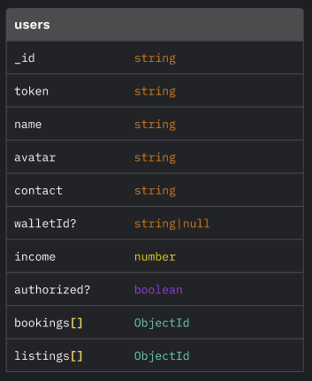
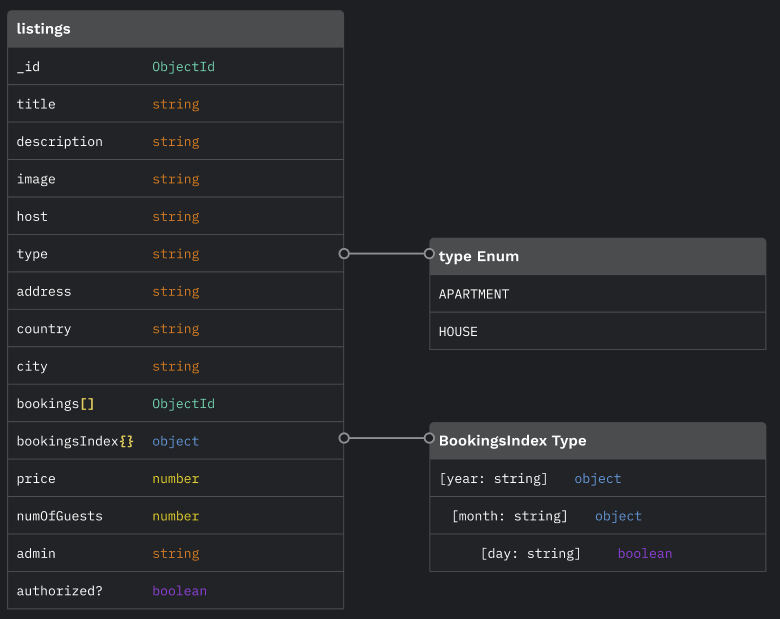
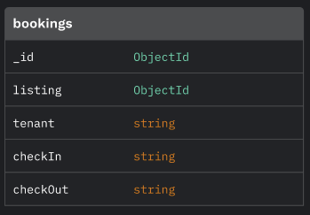

# TinyHouse Airbnb Clone - NodeJS Server

This repository contains the server-side code for a full-stack Airbnb clone built with Express, TypeScript, GraphQL, Apollo Server, and MongoDB. The server code provides the backend functionality for the application.

-   [Features](#features)
-   [Code Structure](#code-structure)
-   [Authentication](#authentication)
-   [Data and Collections](#data-and-collections)
-   [License](#license)

## Features

-   Users can browse and search for listings, create an account to book listings for a specified duration or host their listings.
-   User authentication and account creation with Google OAuth, Google People API, and Google Contacts API.
-   User sessions managed with cookies sharing session ID on each request.
    -   This is done by fundamentally separating user authentication and authorization. The user is authenticated with Google OAuth and then authorized by parsing and confirming the session ID.
-   Image asset management using the Cloudinary image storage service.
-   Searching for listings enabled by utilizing the Google Geo-Location Services API.
-   Transactions for booking listings handled through Stripe payments.
-   Alternate data solutions implemented using PostgreSQL and TypeORM. (This is viewable in this repository's `tim-feat/postgresql` branch.)

## Code Structure

The codebase is organized as follows:

```
├── src
│   ├── database      # Database configuration
│   ├── graphql       # Type definitions and resolvers
│   ├── lib           # Server globabl Types, 3rd party APIs, and utilities
│   ├── temp          # Database seeding and clearing for development
└── ...
```

-   `database`: Contains database configuration and connection settings and exports a function that returns an object of Tables from MongoDB.
    -   The database is initialized and handed over to the Appollo Server context. GraphQL resolvers can then access the `database` object using the context.
-   `graphql`: Holds the Type Definitions and Resolvers for the GraphQL API.
    -   `resolvers`: Contains the GraphQL resolvers that define how to fetch and manipulate data, and local Types mainly consist of function arguments typing.
    -   `typeDefs`: Defines the GraphQL type definitions and schema.
-   `lib`: Holds server global Types and 3rd part API for use throughout the app. Currently contains the code for Google APIs, Cloudinary, and Stripe
    -   `api`: Each API service is packaged as an object for consistency and reusability. In the future, any new features that require API services will be included in this directory and implemented as an object.
    -   `utils`: Includes utility functions used across the application.
-   `temp`: Contains the code to seed and clear the database for development purposes. The `main` branch uses the MongoDB solution, and the `tim-feat/postgresql` branch uses PostgreSQL and TypeORM.

<!-- ## Screenshots -->

<!-- TODO: Add relevant screenshots here to visually explain the code -->

## Authentication

Google OAuth and the Google People API handle the authentication process. When the user clicks the "Sign In With Google" button, the process is as follows:

-   The user is redirected to grant the app permissions to basic account information like name, avatar, and email address. More importantly, the app and Google establish a secure 'connection.'
-   After successfully interacting with Google, they are redirected to the TinyHouse app with a secure `code`.
-   The `code` is forwarded to the server, which requests Google to exchange the code for Google API access tokens. These Google tokens are then used to access the People API and retrieve the user's information.
-   A proprietary `token` is generated on the server with a random 16-bit value. The `token` is stored in the `user` document and used to verify the user's identity during the lifetime of their session.
-   A cookie is then set to the response with the `userId` as its value. This cookie is sent with each request and used to verify the user's session.
-   The `token` is also sent to the client and stored in the browser's `sessionStorage`. It is used to verify the user's identity when making requests to the server.
-   Upon logging out, the server clears the cookie from the response, then the client side removes the `token` from `sessionStorage`, updating any confidential UI.

## Data and Collections

The app's functionality is simple enough that only three collections are needed to store all the data. The collections are as follows:

-   `users`: Stores typical user data, including contact info, income, email, and profile picture. Less typical fields include:

    -   The `walletId` is used to store the user's Stripe wallet ID after they log in and also register for Stripe. It is used to verify transactions and handle UI changes related to transactions.
    -   The `token` is generated after the server receives a code from Google OAuth. It is stored in the `user` document and used to authorize the user's session each time a request is made to the server. See more in the [Authentication](#authentication) section.
    -   The `authorized` field is used to determine whether the user is currently authorized to view certain pieces of information. The `user` query resolver checks this field and returns the user's data if the viewer is able to get a user's information. Otherwise, it returns null. This field is used to prevent users from viewing other users' data, such as their income and contact info.

    <br>

    

<br>

-   `listings`: Stores listing data, including the listing's title, description, and location.

    -   The `host` field is used to store the listing's host's ID. It is used to determine whether the viewer is the host of the listing and whether they can edit or delete the listing (Edit and delete functionality coming later).
    -   The `bookings` field is used to store a record of past bookings for this listing.
    -   The `bookingsIndex` field is used to store the listing's booked dates. It is a set of nested objects whose properties are added as strings of the year, month, day. The day's value is a boolean to indicate truthiness that the day is booked. The `bookingsIndex` is used to safely determine whether a listing is available for a given date range.

    <br>

    

<br>

-   `bookings`: Stores booking data, including the booking's start and end dates, the host, tenant and listing IDs.

    -   This record of bookings is used to update the `bookingsIndex` field in the `listings` collection. The `bookingsIndex` is used to safely determine whether a listing is available for a given date range.

    <br>

    

<br>

## License

This project is licensed under the [MIT License](LICENSE).
